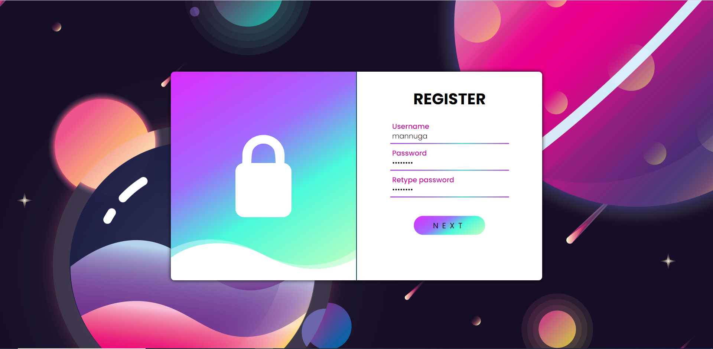
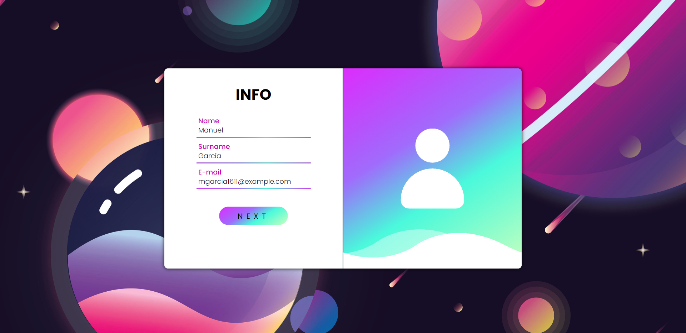
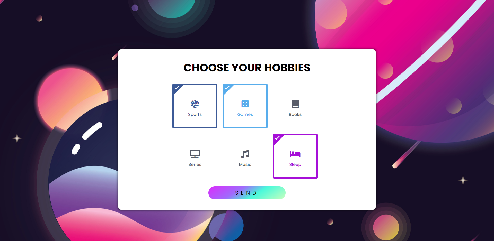
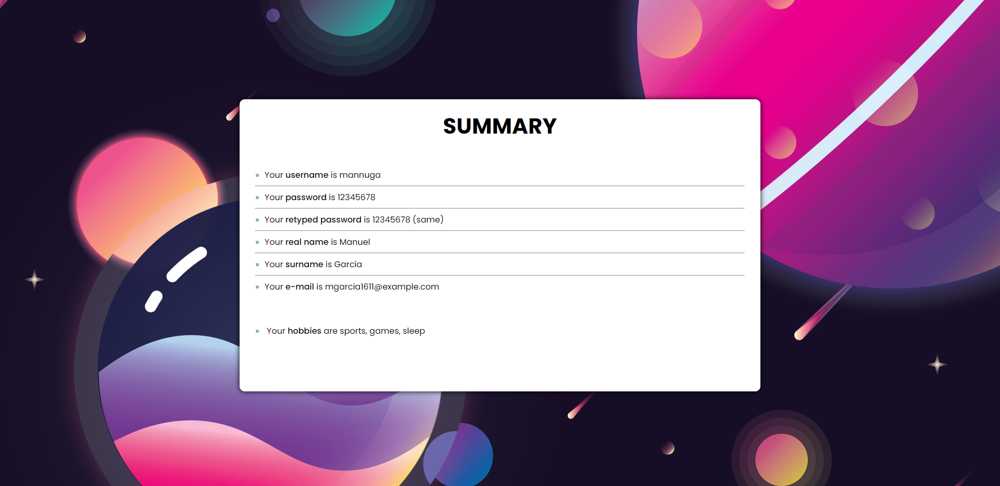

# dwes-ej1-php
 Primer ejercicio PHP para Carmelo

Primera pantalla: Introducimos nombre de usuario, y la contraseña 2 veces:

Segunda pantalla: Introducimos nombre, apellidos y correo electrónico:

Tercera pantalla: Escogemos lo que nos guste:

Última pantalla: Nos muestra todo lo que hemos escogido:

